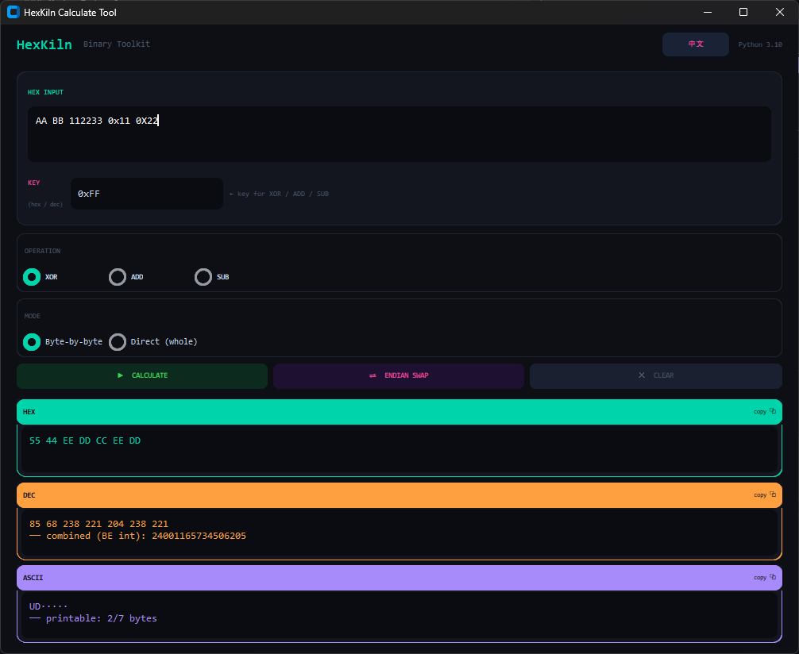

# HexKiln


---

## 🔥 Overview

**HexKiln** is a lightweight Python tool for HEX conversion and byte-level operations, designed for reverse engineering workflows.

It provides quick utilities for:
- HEX parsing
- XOR / ADD / SUB operations
- Endian swapping
- ASCII / DEC visualization

---

## 📸 Screenshots

### Main Interface


---

## ✨ Features

- ⚡ Lightweight & fast Python GUI tool
- 🔁 Byte-by-byte / Direct operation modes
- 🔐 XOR / ADD / SUB support
- ↔ Endian swap (LE ↔ BE)
- 🧠 HEX → DEC → ASCII conversion
- 🌐 Multi-language support (EN / 中文)
- 📋 One-click copy results
- 🪶 Minimal dependency design

---

## 📦 Installation

```bash
git clone https://github.com/sarkewww/HexKiln.git
cd HexKiln
pip install -r requirements.txt
python main.py